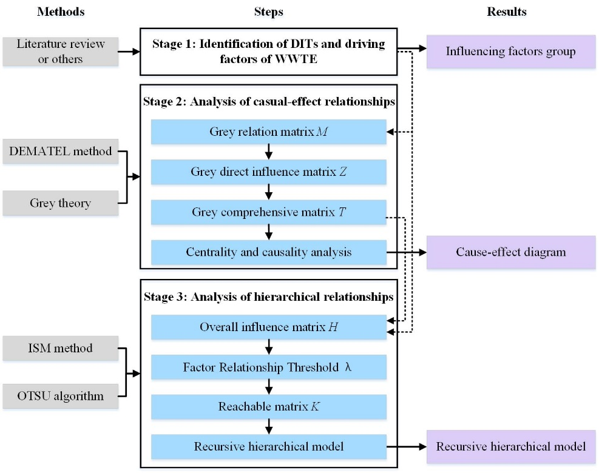
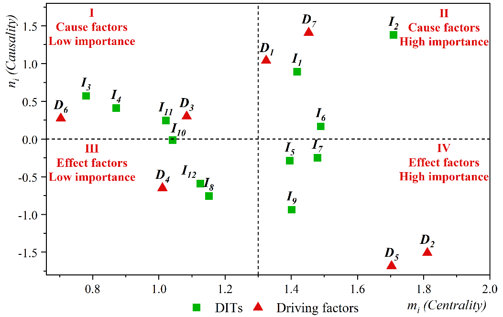
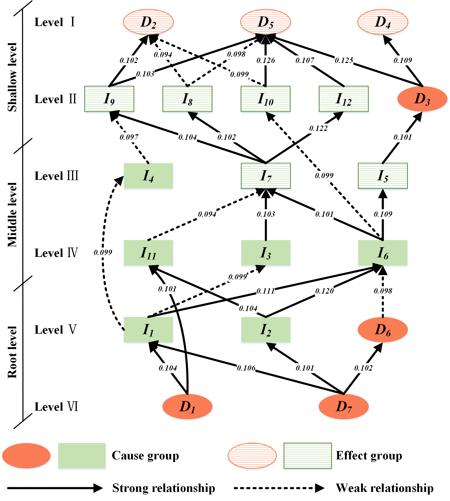

# Improved DEMATEL-ISM Method with Grey Theory and OTSU Algorithm

## 1. Introduction

This repository contains a Python implementation of an improved DEMATEL-ISM method which incorporates Grey Theory and the OTSU algorithm to enhance the analysis of complex systems. The DEMATEL-ISM method is a crucial technique for identifying causal chains analyzing interrelationships among factors and pinpointing key factors within a system. By integrating Grey Theory the method addresses the uncertainty of expert subjective ratings and with the OTSU algorithm it improves the accuracy of threshold determination. The steps for the improved DEMATEL-ISM method are shown below.

## 2. Features

### 2.1 Enhanced DEMATEL-ISM Method
- **Causal Chain Identification:** Effectively identify and analyze the causal relationships among factors within complex systems.
- **Hierarchical Structuring:** Build a clear hierarchical model to visualize the interactions and dependencies between factors.

### 2.2 Integration of Grey Theory
- **Uncertainty Management:** Convert qualitative expert assessments into quantitative grey scores reducing the impact of uncertainty in subjective ratings.
- **Robust Data Handling:** Capture the variability and ambiguity in expert opinions ensuring more reliable and robust results.

### 2.3 Application of the OTSU Algorithm
- **Objective Threshold Determination:** Automatically determine the optimal threshold for distinguishing significant and insignificant relationships among factors.
- **Improved Accuracy:** Minimize intra-class variance to enhance the precision of relationship assessments within the influence matrix.

## 3. Benefits

- **Enhanced Analysis Accuracy:** Address uncertainty and improve threshold determination for more accurate and reliable analysis results.
- **Comprehensive understanding:** Combine causality analysis (derived from the indicators produced by the DEMATEL as shown in the next figure) with hierarchy analysis (derived from the reachable matrix produced by the ISM as shown in the last figure) to provide a comprehensive understanding of the interaction of factors.
- **Robust and Reliable Results:** Validate the approach through sensitivity analysis to ensure the stability and robustness of the conclusions.

